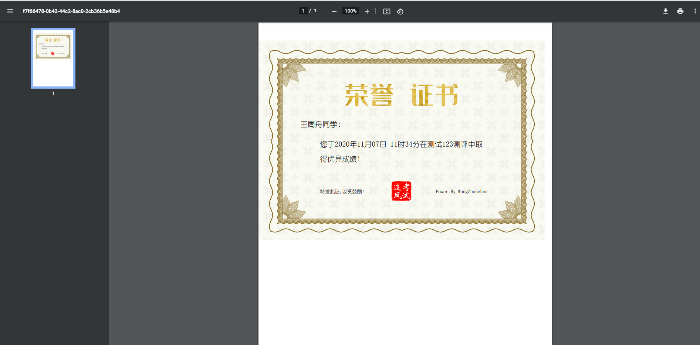
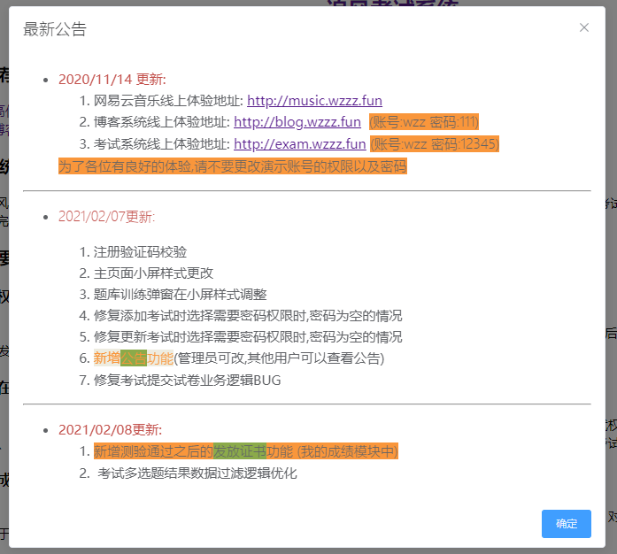
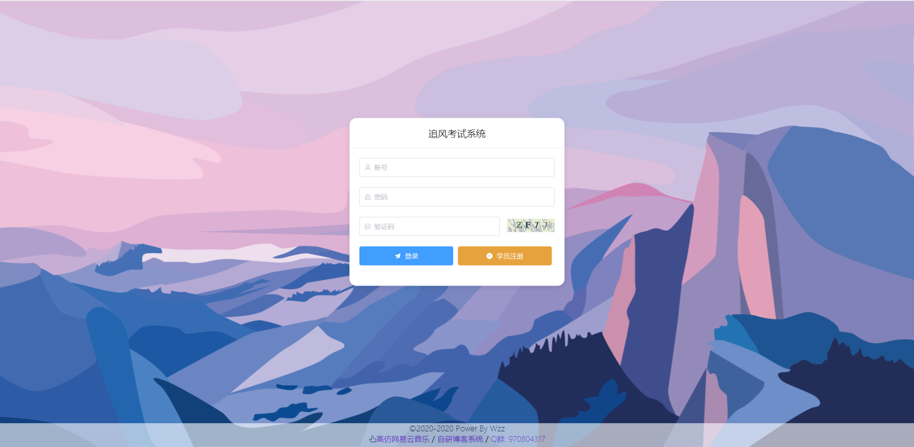
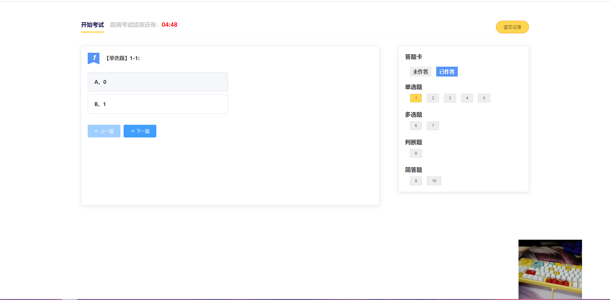
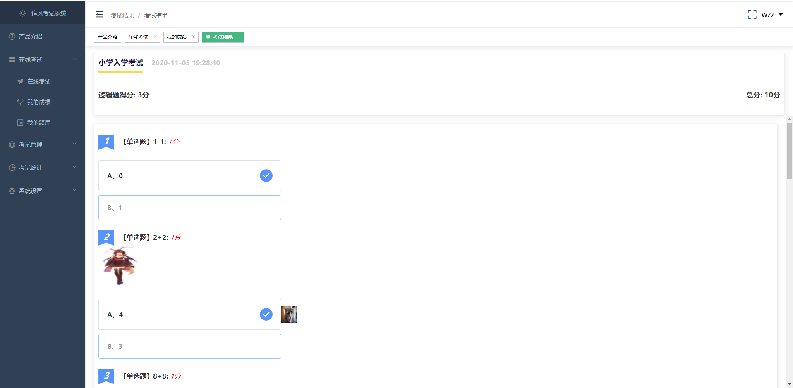
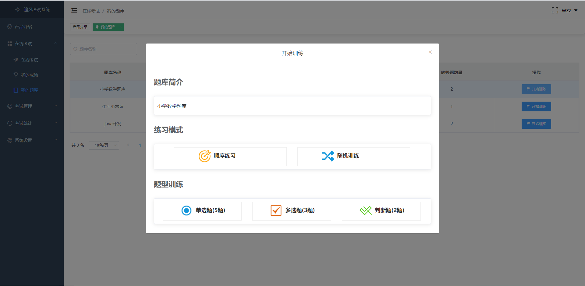
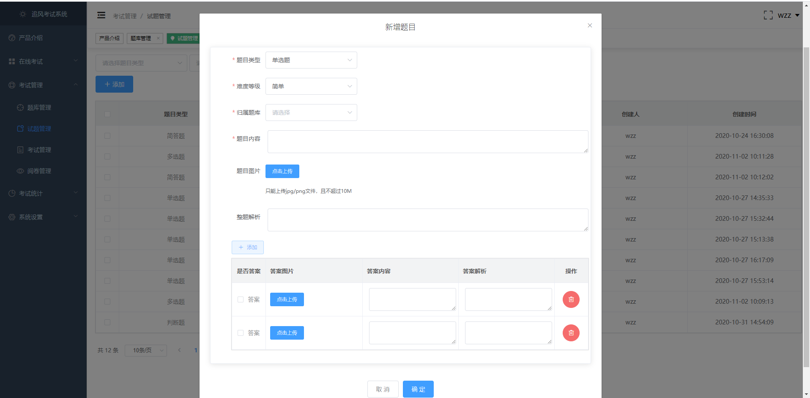
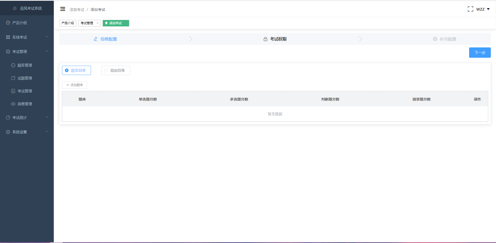
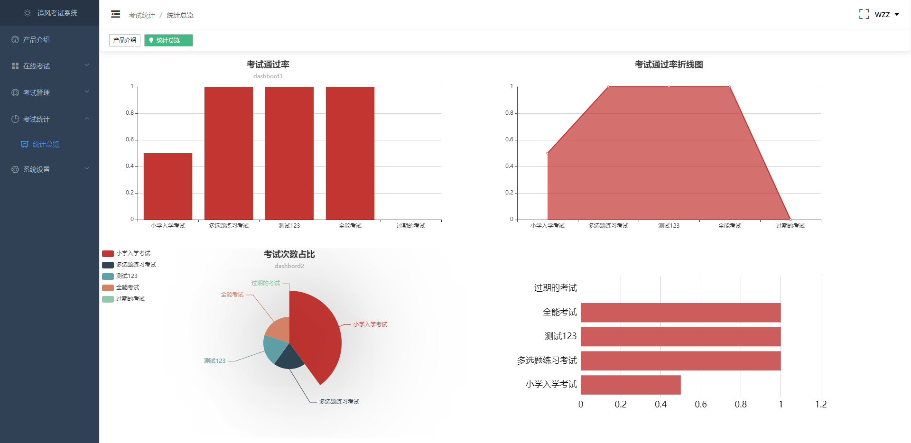
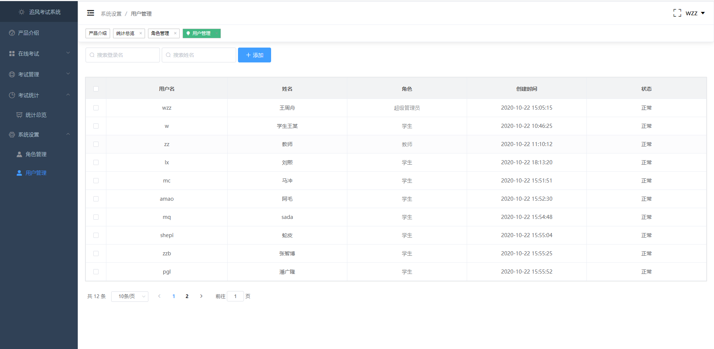

# 在线考试系统（追风考试系统）

一个前后端分离的多角色在线考试系统，包含管理员、教师、学生三类角色，覆盖用户与权限、题库/试题、考试与组卷、在线考试、成绩与阅卷、公告与证书等功能。

## 团队成员与任务分配

| 成员 | 负责内容 |
| --- | --- |
| 刘兴平 | 数据库：建模、脚本维护（`sql/exam_system.sql`）、初始化数据、联调支持 |
| 何子豪 | 后端：接口开发、业务逻辑、权限/鉴权、联调与缺陷修复 |
| 李嘉宝 | 后端：接口开发、业务逻辑、权限/鉴权、联调与缺陷修复 |
| 吴克伟 | 前端：页面与组件开发、交互与样式、接口联调 |
| 黄宇哲 | 前端：页面与组件开发、交互与样式、接口联调 |

## 仓库结构

- `exam-admin(后端代码)/`：后端主工程（Spring Boot）
- `exam-vue/`：前端主工程（Vue 2）
- `sql/`：数据库脚本（`exam_system.sql`）
- `preview/`：功能截图
- `images/`：上传图片目录（与后端 `file.uploadDir` 配置相关）
- `exam-admin/`、`exam-vue(前端代码)/`：历史/备份版本（按需参考）

## 技术栈

**后端**
- Spring Boot 2.5.6（JDK 8）
- MyBatis-Plus
- MySQL（默认库名：`exam_system`）
- Redis
- JWT
- Swagger（如项目启用）

**前端**
- Vue 2 + Vue Router
- Element UI
- Axios
- ECharts

## 主要功能

- 用户/角色/权限管理（管理员、教师、学生）
- 题库管理、试题管理（单选/多选/判断/简答，支持配图）
- 考试管理（公开/口令）、组卷、在线考试（含摄像头采样提示/截图采样）
- 成绩查询、阅卷管理、统计报表
- 公告管理、证书发放

## 默认账号（导入 `sql/exam_system.sql` 后）

- 管理员账号：`wxd`
- 密码：`12345`

> 说明：密码为“加盐 MD5”（后端见 `SaltEncryption`），如你自行改过初始化数据，以你本地 SQL 为准。

## 快速启动

### 0) 环境要求

- JDK 8、Maven
- Node.js + npm
- MySQL
- Redis（如启用缓存相关功能）

### 1) 初始化数据库（MySQL）

1. 创建数据库：`exam_system`
2. 导入脚本：`sql/exam_system.sql`

### 2) 启动后端（Spring Boot）

- 默认端口：`9090`
- 推荐直接用 IDEA 打开 `exam-admin(后端代码)/`，等待 Maven 依赖加载完成后运行 Spring Boot 启动类

常用配置文件（按本机环境修改）：
- `exam-admin(后端代码)/src/main/resources/application.yml`
- `exam-admin(后端代码)/src/main/resources/application-local.yml`（本地 MySQL/Redis）
- `exam-admin(后端代码)/src/main/resources/application-memory.yml`（H2 内存数据库，便于演示）

方式 A：本地 MySQL/Redis（profile=local）
```bash
mvn -f "exam-admin(后端代码)/pom.xml" spring-boot:run -Dspring-boot.run.profiles=local
```

方式 B：H2 内存数据库（profile=memory，无需 MySQL）
```bash
mvn -f "exam-admin(后端代码)/pom.xml" spring-boot:run -Dspring-boot.run.profiles=memory
```

### 3) 启动前端（Vue）

前端接口地址配置在：`exam-vue/public/config.js`（默认 `http://localhost:9090/`）

```bash
cd "exam-vue"
npm install
npm run serve
```

默认访问：`http://localhost:8080/`

## 项目预览（部分）

### 证书发放功能


### 公告功能


### 登录页


### 考试页面


### 考试结果


### 题库训练


### 试题管理


### 考试管理


### 考试数据可视化


### 用户和权限管理


## 注意事项

- 前端请求基地址由 `exam-vue/public/config.js` 的 `window.APIURL` 控制；后端默认端口为 `9090`。
- 上传目录由后端 `file.uploadDir` 配置控制，需按本机环境调整。
- 若出现中文乱码，确保相关文件以 UTF-8 编码保存（VS Code/IDEA 可直接转换编码）。

## 许可与声明

- 本项目仅用于学习使用，请勿用于非法用途。
- License：见 `LICENSE`
